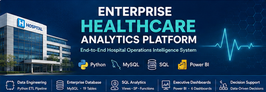

<!-- PROJECT BANNER -->

<p align="center">



</p>

<h1 align="center">
🏥 Enterprise Healthcare Analytics Platform
</h1>

<h3 align="center">
End-to-End Hospital Operations Intelligence System
</h3>

<p align="center">

Transforming Healthcare Data into Executive Business Intelligence using
<strong>Python</strong> •
<strong>MySQL</strong> •
<strong>SQL</strong> •
<strong>Power BI</strong>

</p>

<p align="center">

<a href="#project-overview">Overview</a> •
<a href="#project-architecture">Architecture</a> •
<a href="#business-intelligence-dashboards">Dashboards</a> •
<a href="#installation-guide">Installation</a> •
<a href="#future-enhancements">Future Scope</a>

</p>

---

<p align="center">


</p>

---

# ⭐ Executive Summary

The **Enterprise Healthcare Analytics Platform** is a production-style healthcare analytics solution that integrates **Python**, **MySQL**, **SQL**, and **Power BI** to transform hospital operational data into actionable business intelligence.

The platform simulates an enterprise hospital environment by integrating patient admissions, clinical operations, workforce management, pharmacy, billing, insurance, and resource allocation into a centralized analytics ecosystem.

Designed as an end-to-end analytics solution, the project demonstrates the complete analytics lifecycle—from **data engineering and ETL** to **relational database design**, **SQL analytics**, **KPI development**, and **interactive Power BI dashboards** for executive decision support.

---

## 📊 Project at a Glance

| Category | Details |
|-----------|----------|
| 🏥 Domain | Healthcare Analytics |
| 📂 Datasets | 19 |
| 🗄 Database Tables | 19 |
| 🐍 Python Scripts | 20+ |
| ⚙ SQL Modules | 14 |
| 📊 Power BI Dashboards | 6 |
| 📈 Business KPIs | 40+ |
| 🏗 Database | MySQL |
| 📊 Visualization | Power BI |
| 🔄 ETL | Python |
| 💻 Version Control | Git & GitHub |

---
# ✨ Why This Project?

Unlike traditional dashboard projects, this repository demonstrates the complete analytics lifecycle used in enterprise healthcare organizations—from raw operational data to executive business intelligence.

<div align="center">

| 🏥 Healthcare Domain | 🐍 Python ETL | 🗄️ Enterprise Database | 📊 Power BI |
|:-------------------:|:-------------:|:----------------------:|:-----------:|
| End-to-End Hospital Analytics | Data Cleaning & Feature Engineering | MySQL Relational Database | Executive Dashboards |

| 📈 KPI Reporting | ⚙ SQL Engineering | 🔄 ETL Pipeline | 🚀 Portfolio Project |
|:---------------:|:----------------:|:--------------:|:--------------------:|
| Business Intelligence | Views • Procedures • Triggers | Automated Data Processing | Enterprise Ready |

</div>

---

# 🚀 Key Features

<table>

<tr>
<td width="50%">

### 📂 Data Engineering

- Automated ETL Pipeline
- Data Cleaning
- Data Validation
- Feature Engineering
- Dataset Enhancement

</td>

<td width="50%">

### 🗄️ Database Engineering

- MySQL Database
- Primary & Foreign Keys
- Normalized Schema
- Constraints
- Index Optimization

</td>
</tr>

<tr>
<td>

### 📊 SQL Analytics

- SQL Views
- Business Queries
- Stored Procedures
- SQL Functions
- Database Triggers

</td>

<td>

### 📈 Business Intelligence

- Executive Dashboards
- Interactive Reports
- Healthcare KPIs
- Operational Insights
- Decision Support

</td>
</tr>

</table>

---
# 🔄 End-to-End Analytics Workflow

```text
              Healthcare Operational Data

                         │

                         ▼

              🐍 Python Data Engineering

        Data Cleaning • Validation • ETL

                         │

                         ▼

            📂 Enhanced Healthcare Datasets

                         │

                         ▼

          🗄️ Enterprise MySQL Database

         Tables • Keys • Constraints • Indexes

                         │

                         ▼

             📊 SQL Analytics Layer

 Views • Procedures • Functions • Business Queries

                         │

                         ▼

             📈 Power BI Dashboards

 Executive Reporting • KPI Monitoring • Analytics

                         │

                         ▼

           🏥 Executive Decision Support

```

---
# 📈 Repository Statistics

| 📊 Metric | 📌 Value |
|-----------|---------:|
| Healthcare Datasets | **19** |
| Database Tables | **19** |
| Master Tables | **11** |
| Transaction Tables | **8** |
| Python Scripts | **20+** |
| SQL Modules | **14** |
| Power BI Dashboards | **6** |
| KPIs | **40+** |
| Technologies Used | **Python, MySQL, SQL, Power BI** |

---
---

# 🏗️ Enterprise Architecture

<p align="center">


</p>

The Enterprise Healthcare Analytics Platform follows a modular analytics architecture that transforms raw healthcare operational data into executive-ready business intelligence through an integrated ETL, database, analytics, and visualization pipeline.

### Architecture Components

| Layer | Description |
|--------|-------------|
| 📂 Data Sources | Original Healthcare CSV datasets |
| 🐍 Data Engineering | Python ETL, validation, feature engineering |
| 🗄 Database | Enterprise MySQL relational database |
| 📊 Analytics | SQL views, procedures, functions, KPIs |
| 📈 Visualization | Power BI dashboards |
| 👨‍⚕️ Decision Support | Executive operational reporting |

---
# ⚙️ ETL Pipeline

<p align="center">


</p>

The ETL pipeline automates the transformation of raw hospital datasets into analytics-ready datasets before loading them into the MySQL database.

## ETL Workflow

| Stage | Description |
|--------|-------------|
| Extract | Import raw healthcare datasets |
| Validate | Data quality checks |
| Clean | Handle inconsistencies and missing values |
| Transform | Feature engineering and enrichment |
| Load | Import enhanced datasets into MySQL |
| Analyze | Generate KPIs and business reports |

---
# 🗄️ Enterprise Database Design

<p align="center">


</p>

The database follows a normalized relational model designed for enterprise healthcare analytics.

## Database Highlights

| Feature | Status |
|----------|:------:|
| Third Normal Form (3NF) | ✅ |
| Primary Keys | ✅ |
| Foreign Keys | ✅ |
| Referential Integrity | ✅ |
| Index Optimization | ✅ |
| Modular SQL Scripts | ✅ |
| Enterprise Naming Convention | ✅ |

---

## Database Modules

| Module | Purpose |
|---------|---------|
| Schema | Database creation |
| Constraints | Primary & foreign keys |
| Indexes | Query optimization |
| Import | Dataset loading |
| Views | Business reporting |
| Queries | Analytics |
| Procedures | Automation |
| Functions | Calculations |
| Triggers | Event automation |
| Events | Scheduled jobs |
| Security | Roles & permissions |
| Performance | Query optimization |

---
# 🧩 Data Model

<p align="center">


</p>

The analytical data model integrates patient, admission, billing, workforce, pharmacy, laboratory, and insurance data into a unified relational structure that supports cross-functional reporting.

---
# 📊 Business Intelligence Dashboards

> **Six interactive Power BI dashboards provide executive-level insights into hospital operations.**

---

## 🏥 Dashboard Gallery

| Dashboard | Preview |
|------------|---------|
| Executive Command Center | 🚧 Coming Soon |
| Patient Flow & Admission Analytics | 🚧 Coming Soon |
| Clinical Intelligence Dashboard | 🚧 Coming Soon |
| Financial Intelligence Dashboard | 🚧 Coming Soon |
| Workforce Intelligence Dashboard | 🚧 Coming Soon |
| Pharmacy & Inventory Intelligence Dashboard | 🚧 Coming Soon |

---

### 🏥 Executive Command Center

<p align="center">


</p>

> Screenshot will be added after Power BI export.

---

### 🛏️ Patient Flow & Admission Analytics

<p align="center">


</p>

---

### 🩺 Clinical Intelligence Dashboard

<p align="center">


</p>

---

### 💰 Financial Intelligence Dashboard

<p align="center">


</p>

---

### 👨‍⚕️ Workforce Intelligence Dashboard

<p align="center">


</p>

---

### 💊 Pharmacy & Inventory Intelligence Dashboard

<p align="center">


</p>

---
