# 🏥 Enterprise Healthcare Analytics Platform

### Transforming Healthcare Data into Executive Business Intelligence using Python • MySQL • SQL • Power BI

[](https://www.python.org/)
[](https://www.mysql.com/)
[](https://www.microsoft.com/power-platform/products/power-bi)
[](https://github.com/Deekshita12)
[](LICENSE)

An end-to-end, enterprise-style healthcare analytics platform that transforms hospital operational data into actionable business intelligence through **Python ETL, MySQL database engineering, SQL analytics, and Power BI dashboards**.

---

## 📑 Table of Contents

- [⭐ Executive Summary](#-executive-summary)
- [📊 Project at a Glance](#-project-at-a-glance)
- [✨ Why This Project](#-why-this-project)
- [🚀 Key Features](#-key-features)
- [🔄 End-to-End Analytics Workflow](#-end-to-end-analytics-workflow)
- [🔄 Repository Workflow](#-repository-workflow)
- [🏗️ Enterprise Architecture](#️-enterprise-architecture)
- [⚙️ ETL Pipeline](#️-etl-pipeline)
- [🗄️ Enterprise Database Design](#️-enterprise-database-design)
- [🧩 Data Model](#-data-model)
- [📈 Business Intelligence Dashboards](#-business-intelligence-dashboards)
              - [🏥 Executive Command Center](#-executive-command-center)
              - [🛏️ Patient Flow & Admission Analytics](#️-patient-flow--admission-analytics)
              - [🩺 Clinical Intelligence Dashboard](#-clinical-intelligence-dashboard)
              - [💰 Financial Intelligence Dashboard](#-financial-intelligence-dashboard)
              - [👨‍⚕️ Workforce Intelligence Dashboard](#️-workforce-intelligence-dashboard)
              - [💊 Pharmacy & Inventory Intelligence Dashboard](#-pharmacy--inventory-intelligence-dashboard)
- [📁 Repository Structure](#-repository-structure)
- [🚀 Installation Guide](#-installation-guide)
- [📊 Business KPIs](#-business-kpis)
- [💡 Business Insights](#-business-insights)
- [💼 Skills Demonstrated](#-skills-demonstrated)
- [📖 Project Documentation](#-project-documentation)
- [🗺️ Project Roadmap](#️-project-roadmap)
- [🌟 Why This Project Stands Out](#-why-this-project-stands-out)
- [🤝 Acknowledgements](#-acknowledgements)
- [👩‍💻 Author](#-author)
- [📄 License](#-license)

---

# ⭐ Executive Summary

The **Enterprise Healthcare Analytics Platform** is a production-style healthcare analytics solution designed to simulate a real-world hospital analytics environment.

The platform integrates:

- Patient admissions and hospital operations
- Clinical and diagnostic activity
- Workforce management
- Bed and resource utilization
- Pharmacy and inventory operations
- Billing and financial performance
- Insurance information
- Executive-level KPI reporting

The solution demonstrates the complete analytics lifecycle:

**Raw Healthcare Data → Python ETL → Enhanced Datasets → MySQL → SQL Analytics → Power BI → Executive Decision Support**

The project demonstrates practical capabilities across **Data Analytics, Data Engineering, SQL, Database Engineering, Business Intelligence, and Healthcare Operations Analytics**.

---

# 📊 Project at a Glance

| Category | Details |
|---|---|
| 🏥 Domain | Healthcare Analytics |
| 📂 Healthcare Datasets | 19 |
| 🗄️ Database Tables | 19 |
| 🧱 Master Tables | 11 |
| 🔄 Transaction Tables | 8 |
| 🐍 Python Scripts | 20+ |
| ⚙️ SQL Modules | 14 |
| 📊 Power BI Dashboards | 6 |
| 📈 Business KPIs | 40+ |
| 🗄️ Database | MySQL 8.x |
| 🐍 Data Engineering | Python / Pandas |
| 📊 Visualization | Power BI |
| 💻 Version Control | Git & GitHub |

---

# ✨ Why This Project

Unlike a dashboard-only project, this platform demonstrates the complete path from **raw operational data to executive business intelligence**.

### 🏥 Healthcare Domain

End-to-end analysis of hospital operations, patients, admissions, clinical activity, workforce, pharmacy, billing, insurance, and resources.

### 🐍 Python Data Engineering

Data cleaning, validation, transformation, feature engineering, dataset enhancement, and preparation for database ingestion.

### 🗄️ Enterprise Database

A normalized MySQL relational database with primary keys, foreign keys, constraints, indexes, and modular SQL development.

### ⚙️ SQL Analytics

Business-focused views, queries, stored procedures, functions, triggers, events, and performance-oriented SQL development.

### 📊 Business Intelligence

Six Power BI dashboards designed around operational, clinical, financial, workforce, pharmacy, and executive decision-making needs.

---

# 🚀 Key Features

## 📂 Data Engineering

- Python-based ETL workflow
- Data cleaning
- Data validation
- Missing-value handling
- Feature engineering
- Dataset enhancement
- Analytics-ready CSV generation
- Data quality auditing

## 🗄️ Database Engineering

- MySQL 8.x
- Normalized relational schema
- Third Normal Form (3NF)
- Primary keys
- Foreign keys
- Referential integrity
- Constraints
- Index optimization
- Modular SQL architecture
- Enterprise naming conventions

## 📊 SQL Analytics

- SQL views
- Business queries
- Stored procedures
- SQL functions
- Database triggers
- Scheduled database events
- KPI calculations
- Performance optimization

## 📈 Business Intelligence

- Executive reporting
- Interactive Power BI dashboards
- Hospital KPI monitoring
- Operational analytics
- Clinical intelligence
- Financial intelligence
- Workforce analytics
- Pharmacy and inventory analytics
- Decision-support reporting

---

# 🔄 End-to-End Analytics Workflow

```text
Healthcare Operational Data
            │
            ▼
┌───────────────────────────────┐
│     Python Data Engineering   │
│ Cleaning • Validation • ETL   │
│ Feature Engineering           │
└───────────────┬───────────────┘
                │
                ▼
┌───────────────────────────────┐
│    Enhanced Healthcare Data   │
│      Analytics-Ready CSVs     │
└───────────────┬───────────────┘
                │
                ▼
┌───────────────────────────────┐
│        Enterprise MySQL       │
│ Tables • Keys • Constraints   │
│ Indexes • Referential Integrity│
└───────────────┬───────────────┘
                │
                ▼
┌───────────────────────────────┐
│       SQL Analytics Layer     │
│ Views • Queries • Procedures  │
│ Functions • Triggers • Events │
└───────────────┬───────────────┘
                │
                ▼
┌───────────────────────────────┐
│          Power BI             │
│ 6 Executive & Operational     │
│ Dashboards                    │
└───────────────┬───────────────┘
                │
                ▼
┌───────────────────────────────┐
│    Executive Decision Support │
│ KPI Monitoring • Trends       │
│ Operational Insights          │
└───────────────────────────────┘
```

---

# 🔄 Repository Workflow

The repository follows a structured workflow that separates data engineering, database development, analytics, visualization, and project documentation.

```text
Raw Healthcare Datasets
          │
          ▼
     Python ETL
          │
          ▼
   Enhanced Datasets
          │
          ▼
     MySQL Database
          │
          ▼
     SQL Analytics
          │
          ▼
     Power BI Reports
          │
          ▼
   Business Insights
          │
          ▼
     GitHub Repository
```

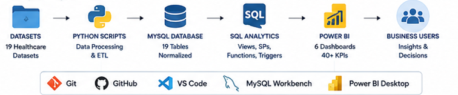

---

# 🏗️ Enterprise Architecture

The platform follows a modular architecture separating **data engineering, database development, analytics, visualization, and decision support**.

## Architecture Components

| Layer | Description |
|---|---|
| 📂 Data Sources | Original healthcare CSV datasets |
| 🐍 Data Engineering | Python ETL, validation, cleaning, feature engineering |
| 📂 Enhanced Data | Analytics-ready healthcare datasets |
| 🗄️ Database | Enterprise MySQL relational database |
| 📊 Analytics | SQL views, queries, procedures, functions, triggers and KPIs |
| 📈 Visualization | Power BI dashboards |
| 👨‍⚕️ Decision Support | Executive and operational reporting |

## Architecture Diagram

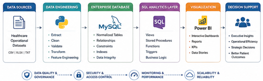

---

# ⚙️ ETL Pipeline

The ETL layer prepares raw hospital datasets for reliable analytical use.

## ETL Workflow

| Stage | Description |
|---|---|
| **Extract** | Import raw healthcare datasets |
| **Validate** | Perform data quality and structural checks |
| **Clean** | Handle inconsistencies and missing values |
| **Transform** | Engineer and enrich analytical attributes |
| **Load** | Import enhanced datasets into MySQL |
| **Analyze** | Generate KPIs, business views, and reports |

## ETL Pipeline Diagram

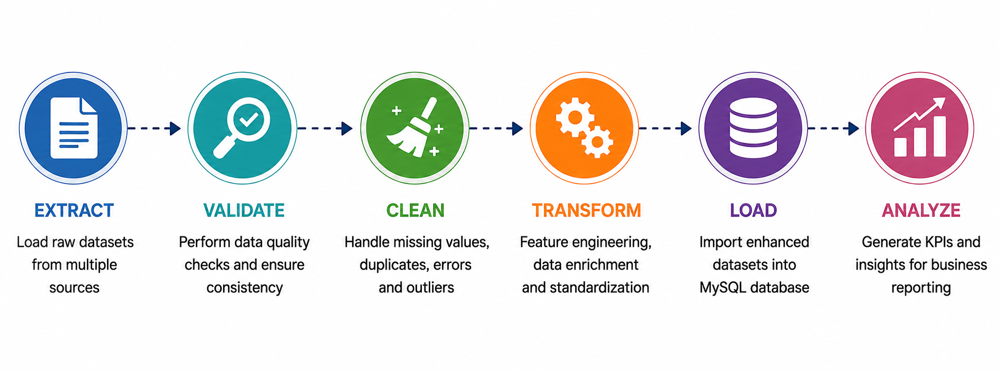

---

# 🗄️ Enterprise Database Design

The database follows a normalized relational design intended to support cross-functional hospital analytics.

## Database Highlights

| Feature | Status |
|---|:---:|
| Third Normal Form (3NF) | ✅ |
| Primary Keys | ✅ |
| Foreign Keys | ✅ |
| Referential Integrity | ✅ |
| Constraints | ✅ |
| Index Optimization | ✅ |
| Modular SQL Scripts | ✅ |
| Enterprise Naming Convention | ✅ |

## Database Modules

| Module | Purpose |
|---|---|
| Schema | Database creation |
| Master Tables | Core hospital entities |
| Transaction Tables | Operational healthcare transactions |
| Constraints | Primary and foreign key enforcement |
| Indexes | Query optimization |
| Import | Enhanced dataset loading |
| Views | Business reporting |
| Queries | Analytical SQL |
| Procedures | Reusable database operations |
| Functions | Business calculations |
| Triggers | Event-driven automation |
| Events | Scheduled database jobs |
| Security | Roles and permissions |
| Performance | Query and database optimization |

---

# 🧩 Data Model

The analytical data model integrates hospital entities and operational transactions across:

- Patients
- Admissions
- Departments
- Doctors
- Employees
- Wards
- Beds
- Diseases
- Diagnostic Tests
- Patient Diagnostics
- Billing
- Billing Details
- Insurance Providers
- Drug Manufacturers
- Drugs
- Drug Inventory
- Pharmacy-related operations

The model is designed to support cross-functional reporting while maintaining relational integrity between operational entities.

## ER Diagram

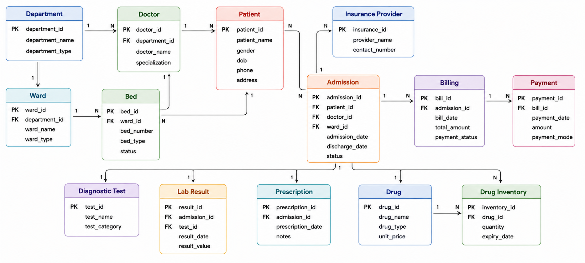

## Data Model

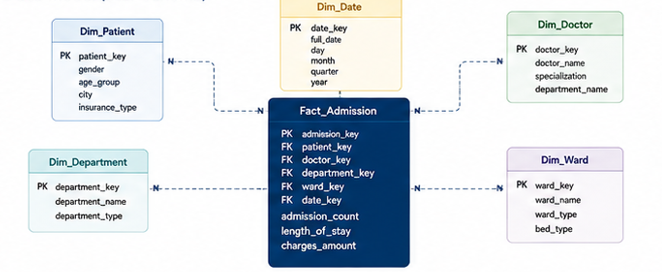

---

# 📈 Business Intelligence Dashboards

The platform contains **six Power BI dashboards**, each designed for a specific decision-making layer of hospital operations.

---

## 🏥 1. Executive Command Center

Provides a high-level view of hospital-wide performance and executive KPIs.

### Key Areas

- Total patients
- Total admissions
- Bed occupancy
- Average length of stay
- Discharge performance
- Revenue
- Workforce
- Pharmacy indicators
- Operational trends

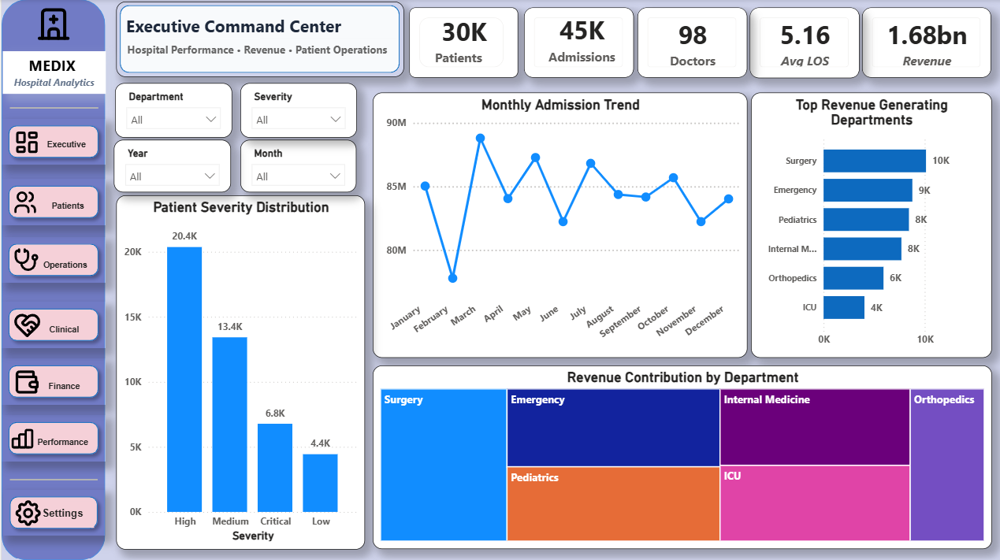

---

## 🛏️ 2. Patient Flow & Admission Analytics

Focuses on patient movement and admission operations.

### Key Areas

- Admission volume
- Patient flow
- Department-level activity
- Bed utilization
- Length of stay
- Discharge trends
- Operational bottlenecks

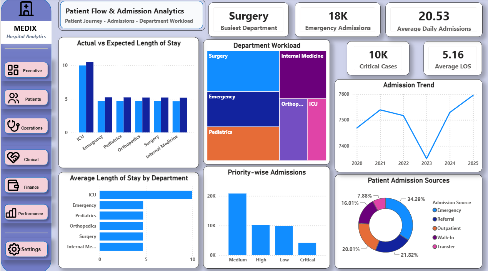

---

## 🩺 3. Clinical Intelligence Dashboard

Provides analytical visibility into clinical and diagnostic activity.

### Key Areas

- Disease patterns
- Diagnostic utilization
- Clinical activity
- Treatment-related trends
- Patient clinical distribution
- Department-level clinical performance

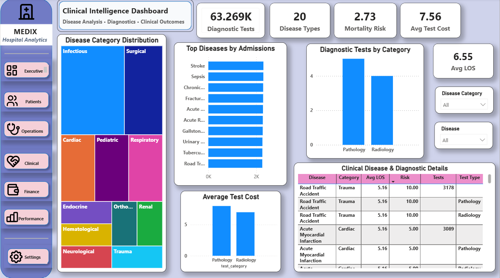

---

## 💰 4. Financial Intelligence Dashboard

Provides visibility into hospital financial performance.

### Key Areas

- Total revenue
- Billing performance
- Department revenue
- Average billing amount
- Insurance contribution
- Outstanding payments
- Financial trends

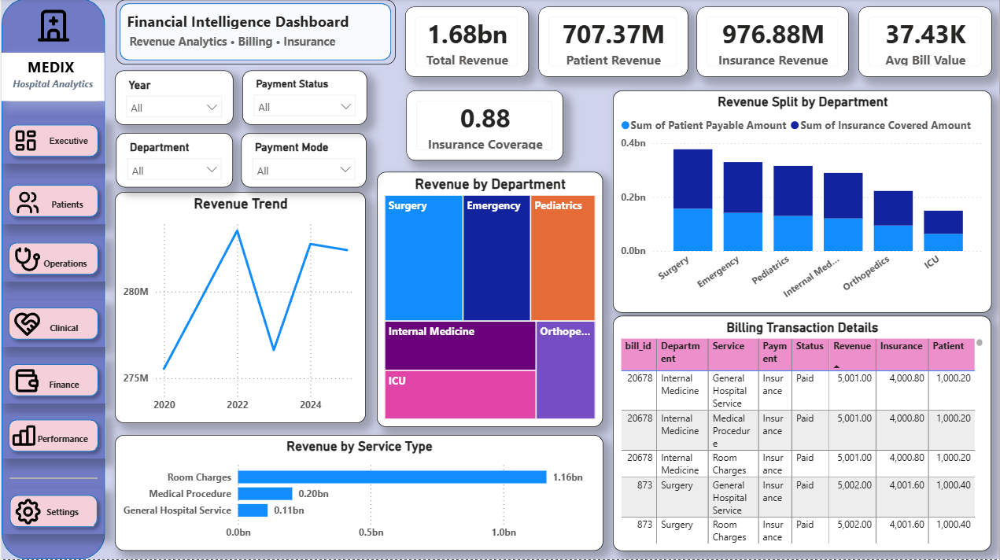

---

## 👨‍⚕️ 5. Workforce Intelligence Dashboard

Analyzes workforce distribution and staffing across hospital departments.

### Key Areas

- Total employees
- Active doctors
- Workforce distribution
- Department staffing
- Staff allocation
- Staff availability
- Workforce utilization

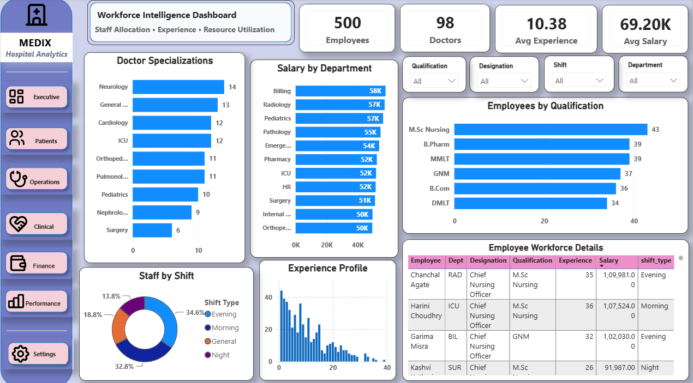

---

## 💊 6. Pharmacy & Inventory Intelligence Dashboard

Provides visibility into pharmacy operations and medicine inventory.

### Key Areas

- Medicine inventory
- Low-stock medicines
- Inventory utilization
- Manufacturer distribution
- Prescription volume
- Pharmacy performance
- Stock availability

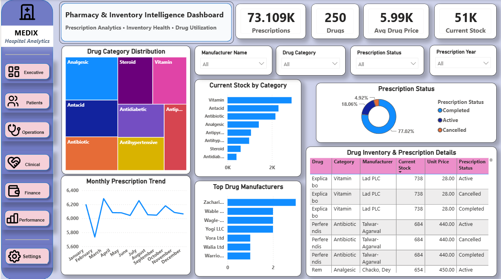

---

# 📁 Repository Structure

The repository follows a modular enterprise structure separating datasets, documentation assets, Python engineering, MySQL development, and Power BI reporting.

```text
Enterprise-Healthcare-Analytics-Platform/
│
├── datasets/
│   ├── original/
│   └── enhanced/
│
├── documentation/
│   ├── images/
│   │   ├── architecture.png
│   │   ├── etl_pipeline.png
│   │   ├── workflow.png
│   │   ├── er_diagram.png
│   │   ├── data_model.png
│   │   ├── dashboard_1.png
│   │   ├── dashboard_2.png
│   │   ├── dashboard_3.png
│   │   ├── dashboard_4.png
│   │   ├── dashboard_5.png
│   │   └── dashboard_6.png
│   │
│   └── enhanced_dataset_audit_summary.csv
│
├── mysql/
│   ├── schema/
│   ├── constraints/
│   ├── indexes/
│   ├── import/
│   ├── views/
│   ├── queries/
│   ├── procedures/
│   ├── functions/
│   ├── triggers/
│   ├── events/
│   ├── security/
│   └── performance/
│
├── powerbi/
│   ├── Enterprise Healthcare Analytics Platform.pbix
│   └── README.md
│
├── python/
│   ├── enhancement/
│   └── audit/
│
├── README.md
├── LICENSE
├── .gitignore
```

> **Note:** The `utils` folder and separate Markdown documentation files are not part of the final repository structure.

---

# 🚀 Installation Guide

## 1️⃣ Clone the Repository

```bash
git clone https://github.com/Deekshita12/Enterprise-Healthcare-Analytics-Platform.git
```

## 2️⃣ Navigate to the Project Directory

```bash
cd Enterprise-Healthcare-Analytics-Platform
```

## 3️⃣ Set Up Python

Create a virtual environment:

```bash
python -m venv venv
```

Activate it on Windows:

```bash
venv\Scripts\activate
```

Install the Python packages used by the ETL workflow:

```bash
pip install pandas numpy
```

## 4️⃣ Prepare the Datasets

The project contains:

```text
datasets/
├── original/
└── enhanced/
```

The `original` directory contains the source datasets.

The `enhanced` directory contains the cleaned, validated, transformed, and analytics-ready datasets.

## 5️⃣ Run Python Data Engineering

Python scripts are organized under:

```text
python/
├── enhancement/
└── audit/
```

The enhancement scripts perform:

- Data cleaning
- Feature engineering
- Data transformation
- Dataset enrichment
- Analytics-ready dataset generation

The audit scripts support:

- Data validation
- Row-count verification
- Column validation
- Data-quality checks
- Enhanced dataset auditing

## 6️⃣ Create the MySQL Database

Install **MySQL 8.x** and open MySQL Workbench or another MySQL client.

Execute the SQL modules in this order:

| Order | SQL Module | Purpose |
|---:|---|---|
| 01 | Database Creation | Creates the healthcare analytics database |
| 02 | Master Tables | Creates core reference tables |
| 03 | Transaction Tables | Creates operational transaction tables |
| 04 | Foreign Keys | Establishes table relationships |
| 05 | Indexes | Optimizes database queries |
| 06 | Import Enhanced Datasets | Loads analytics-ready CSV data |
| 07 | SQL Views | Creates reusable analytical views |
| 08 | Business Queries | Executes analytical business queries |
| 09 | Stored Procedures | Implements reusable database procedures |
| 10 | SQL Functions | Implements reusable calculations |
| 11 | Database Triggers | Automates event-driven database actions |
| 12 | Scheduled Events | Implements scheduled database operations |
| 13 | Security Roles | Defines database access roles |
| 14 | Performance Optimization | Implements performance-focused SQL configuration |

## 7️⃣ Load the Enhanced Datasets

Enhanced datasets are located in:

```text
datasets/enhanced/
```

Use the SQL import scripts under:

```text
mysql/import/
```

to load the datasets into the corresponding MySQL tables.

> **Important:** If the import scripts use `LOAD DATA LOCAL INFILE`, make sure MySQL Workbench/server settings permit local file loading.

## 8️⃣ Create the SQL Analytics Layer

After the data has been loaded, execute the analytical and automation modules:

```text
mysql/views/
mysql/queries/
mysql/procedures/
mysql/functions/
mysql/triggers/
mysql/events/
```

## 9️⃣ Open Power BI

Open:

```text
powerbi/Enterprise Healthcare Analytics Platform.pbix
```

Connect or refresh the MySQL data source as required by the local environment.

## 🔟 Refresh the Report

In Power BI:

```text
Home → Refresh
```

Verify that the required tables and SQL views are available before using the dashboards.

---

# 📊 Business KPIs

The platform supports **40+ business KPIs** across executive, operational, financial, clinical, workforce, and pharmacy functions.

## 🏥 Executive KPIs

- Total Patients
- Total Admissions
- Bed Occupancy Rate
- Average Length of Stay
- Discharge Rate
- Available Beds

## 💰 Financial KPIs

- Total Revenue
- Billing Performance
- Insurance Coverage
- Department Revenue
- Average Billing Amount
- Outstanding Payments

## 👨‍⚕️ Workforce KPIs

- Total Employees
- Active Doctors
- Staff Allocation
- Department Utilization
- Workforce Distribution
- Staff Availability

## 💊 Pharmacy KPIs

- Medicine Inventory
- Low Stock Medicines
- Inventory Utilization
- Manufacturer Distribution
- Prescription Volume
- Pharmacy Performance

## 🩺 Additional Analytical Areas

The SQL and Power BI layers also support analysis of:

- Disease patterns
- Diagnostic utilization
- Patient flow
- Admission activity
- Department performance
- Bed utilization
- Billing activity
- Insurance contribution
- Workforce distribution
- Medicine inventory
- Pharmacy operations

---

# 💡 Business Insights

The platform transforms hospital operational data into actionable business intelligence.

## 🏥 Executive Insights

- Monitor hospital-wide operational performance
- Track organizational KPIs
- Identify performance trends across departments
- Compare operational performance
- Support data-driven strategic decisions

## 🛏️ Patient Flow & Operations

- Monitor admission activity
- Evaluate patient flow
- Improve admission and discharge efficiency
- Monitor average length of stay
- Evaluate bed utilization
- Identify operational bottlenecks
- Support resource allocation decisions

## 🩺 Clinical Insights

- Analyze disease patterns
- Monitor diagnostic utilization
- Evaluate clinical activity
- Analyze patient clinical distribution
- Compare department-level clinical activity
- Identify treatment-related trends

## 💰 Financial Insights

- Monitor revenue performance
- Analyze billing efficiency
- Compare department revenue
- Evaluate insurance contribution
- Monitor average billing value
- Track outstanding payments

## 👨‍⚕️ Workforce Insights

- Analyze employee distribution
- Monitor doctor availability
- Evaluate department staffing
- Support workforce allocation
- Monitor workforce utilization
- Analyze staffing patterns

## 💊 Pharmacy & Inventory Insights

- Track medicine inventory
- Identify low-stock medicines
- Monitor inventory utilization
- Analyze manufacturer distribution
- Monitor prescription volume
- Support procurement planning
- Reduce inventory shortages

---

# 💼 Skills Demonstrated

## 🐍 Data Engineering

- Python
- Pandas
- Data Cleaning
- Data Validation
- Feature Engineering
- Data Transformation
- ETL Development
- Dataset Enhancement
- Data Quality Auditing

## 🗄️ Database Engineering

- MySQL 8.x
- Relational Database Design
- Database Normalization
- Third Normal Form (3NF)
- Primary Keys
- Foreign Keys
- Referential Integrity
- Constraints
- Indexing
- Query Optimization
- Enterprise Naming Conventions

## 📊 SQL Analytics

- SQL Views
- Business Queries
- Stored Procedures
- SQL Functions
- Database Triggers
- Scheduled Events
- KPI Calculations
- Analytical SQL
- Performance Optimization

## 📈 Business Intelligence

- Microsoft Power BI
- KPI Development
- Executive Dashboards
- Operational Dashboards
- Interactive Reporting
- Data Storytelling
- Business Analysis
- Decision Support

## 💻 Version Control & Documentation

- Git
- GitHub
- Repository Architecture
- Technical Documentation
- Data Dictionary Development
- KPI Documentation
- System Architecture Documentation
- Project Workflow Documentation

---

# 📖 Project Documentation

The repository includes supporting documentation assets covering business requirements, data definitions, architecture, KPIs, workflow, database relationships, and enhanced dataset quality.

| Documentation Asset | Description | Status |
|---|---|:---:|
| 📋 Business Requirements | Functional and business objectives | ✅ |
| 📚 Data Dictionary | Dataset and attribute definitions | ✅ |
| 📊 KPI Definitions | Business metrics and calculation logic | ✅ |
| 🏗️ System Architecture | End-to-end technical architecture | ✅ |
| 🔄 Project Workflow | Complete implementation workflow | ✅ |
| 🧩 ER Diagram | Database relationship documentation | ✅ |
| 🔍 Enhanced Dataset Audit | Data quality and enhancement audit | ✅ |

### 📂 Documentation Assets

All supporting visual documentation is maintained inside:

```text
documentation/
│
├── images/
│   ├── architecture.png
│   ├── etl_pipeline.png
│   ├── workflow.png
│   ├── er_diagram.png
│   ├── data_model.png
│   ├── dashboard_1.png
│   ├── dashboard_2.png
│   ├── dashboard_3.png
│   ├── dashboard_4.png
│   ├── dashboard_5.png
│   └── dashboard_6.png
│
└── enhanced_dataset_audit_summary.csv
```

The documentation assets support the project's architecture, ETL workflow, data model, database relationships, dashboard presentation, and dataset quality validation.

---

# 🗺️ Project Roadmap

| Version | Capability | Status |
|---|---|:---:|
| Version 1.0 | Enterprise Database Design | ✅ Complete |
| Version 1.0 | Python ETL Pipeline | ✅ Complete |
| Version 1.0 | SQL Analytics Layer | ✅ Complete |
| Version 1.0 | Power BI Dashboards | ✅ Complete |
| Version 1.1 | Documentation Suite | ✅ Complete |
| Version 1.2 | Architecture & Data Model Documentation | ✅ Complete |

---

# 🌟 Why This Project Stands Out

This project goes beyond a conventional Power BI portfolio dashboard by demonstrating a complete enterprise analytics workflow.

### ✅ End-to-End Analytics

Raw operational healthcare data is transformed into decision-ready business intelligence.

### ✅ Data Engineering

Python is used for cleaning, validation, enrichment, feature engineering, and ETL preparation.

### ✅ Enterprise Database Design

MySQL provides a structured relational foundation with normalization, constraints, relationships, indexes, and modular SQL development.

### ✅ Production-Style SQL

The project includes:

- Views
- Business queries
- Stored procedures
- Functions
- Triggers
- Scheduled events
- Security
- Performance optimization

### ✅ Executive Business Intelligence

Six Power BI dashboards translate operational data into business KPIs, trends, and actionable insights.

### ✅ Healthcare Operations Focus

The platform covers:

- Patient flow
- Admissions
- Clinical activity
- Diagnostics
- Workforce
- Finance
- Billing
- Insurance
- Pharmacy
- Inventory
- Hospital resources

### ✅ Professional Repository Architecture

The project separates:

```text
Datasets
    ↓
Python Engineering
    ↓
MySQL Database
    ↓
SQL Analytics
    ↓
Power BI
    ↓
Documentation Assets
```

This makes the project easier to understand, maintain, extend and present as a professional analytics portfolio.

---

# 🤝 Acknowledgements

This project was developed as an enterprise-style healthcare analytics portfolio project to simulate real-world analytics practices used across hospitals, consulting organizations and business intelligence teams.

Special focus was placed on:

- Enterprise database architecture
- Data engineering best practices
- Business-oriented KPI development
- SQL analytics engineering
- Executive dashboard design
- Healthcare operations analytics
- Professional GitHub documentation
- Business-focused data storytelling

---

# 👩‍💻 Author

## Deekshita Donthula

**Data Analyst | Python | SQL | MySQL | Power BI**

Passionate about transforming complex data into meaningful business intelligence through analytics, automation, database engineering, and interactive reporting.

### 📬 Connect

- 💼 LinkedIn: [Deekshita Donthula]([https://www.linkedin.com/in/your-profile-name/](https://www.linkedin.com/in/deekshita-donthula-456a49266/)
- 📧 Email: *donthuladeekshita@gmail.com*
- 🐙 GitHub: [Deekshita12](https://github.com/Deekshita12)

---

# 📄 License

This project is licensed under the **MIT License**.

You are free to use, modify, and distribute this project under the terms of the license.

See the [LICENSE](LICENSE) file for more information.

---

<div align="center">

# 🏥 Enterprise Healthcare Analytics Platform

### End-to-End Hospital Operations Intelligence System

**Built with**

🐍 Python • 🗄️ MySQL • 📊 SQL • 📈 Power BI • 💻 GitHub

⭐ **If you found this project useful, consider giving the repository a Star!**

**© 2026 Deekshita Donthula**

</div>
